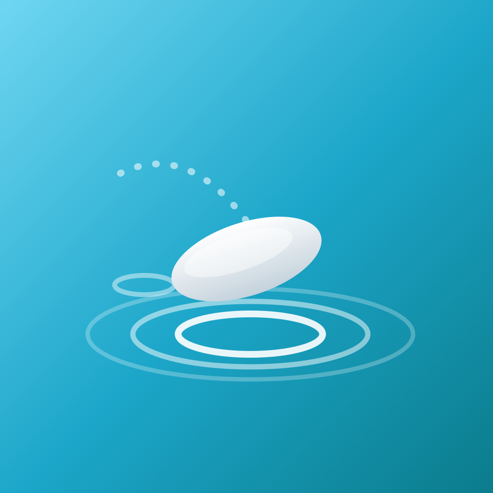

  

<h1 align="center">SkipStone</h1>

<strong>Skip the cloud.</strong> Send photos, videos, and files straight between your devices — no uploads, no size limits, no server ever touching your files.

  
  

---

## Download

| Platform | Get it |
|---|---|
| 🍎 **Mac** (Apple Silicon) | [**Download SkipStone-mac.dmg**](https://github.com/myliustech/skipstone-releases/releases/latest/download/SkipStone-mac.dmg) |
| 🪟 **Windows** (64-bit) | [**Download SkipStone-win.exe**](https://github.com/myliustech/skipstone-releases/releases/latest/download/SkipStone-win.exe) |
| 📱 **iPhone / iPad** | [App Store](https://apps.apple.com/us/app/skipstone-share-anything/id6782159409) |
| 🤖 **Android** | [Google Play](https://play.google.com/store/apps/details?id=com.myliustech.skipstone) |
| 🌐 **Any browser** | [app.skipstoneapp.com](https://app.skipstoneapp.com) — nothing to install |

> Older versions are on the [Releases page](https://github.com/myliustech/skipstone-releases/releases).

### Installing on Mac

The app isn't notarized yet, so the first launch needs one extra step: after opening the
`.dmg` and dragging SkipStone to Applications, **right-click the app → Open → Open**.
macOS remembers your choice; every later launch is normal.

### Installing on Windows

Windows SmartScreen may show *"Windows protected your PC"* on first run. Click
**More info → Run anyway**. This happens because the installer is not yet code-signed,
not because anything is wrong with it.

---

## What is SkipStone?

SkipStone sends files **directly between devices** — over your local WiFi at full speed,
over Bluetooth with no internet at all, or through an encrypted direct connection when
you're apart. Your files are never uploaded to or stored on a server.

- 🚀 **Blazing fast** — device to device, no upload step
- 📦 **No limits** — unlimited files of any size, even multi-gigabyte videos
- 🔒 **Private by design** — peer-to-peer and encrypted, no cloud in the middle
- 💻 **Truly cross-platform** — phones, Mac, PC, and the web all share with each other
- 📴 **Works offline** — local WiFi and Bluetooth transfers need no internet

Learn more at [skipstoneapp.com](https://skipstoneapp.com).

---

  © 2026 <a href="https://myliustech.com">MyliusTech LLC</a> ·
  <a href="https://skipstoneapp.com/terms">Terms</a> ·
  <a href="https://skipstoneapp.com/privacy">Privacy</a> ·
  <a href="https://skipstoneapp.com/support">Support</a>

